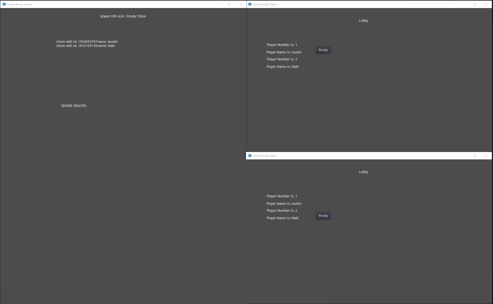
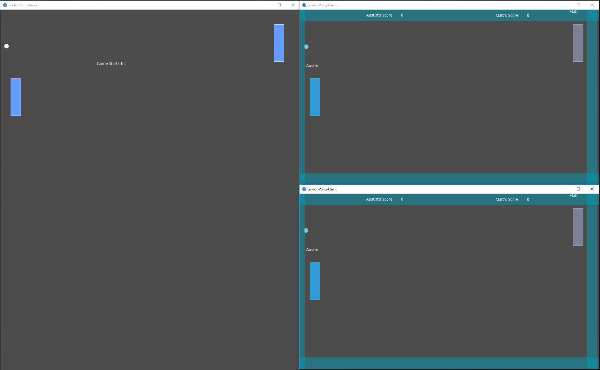
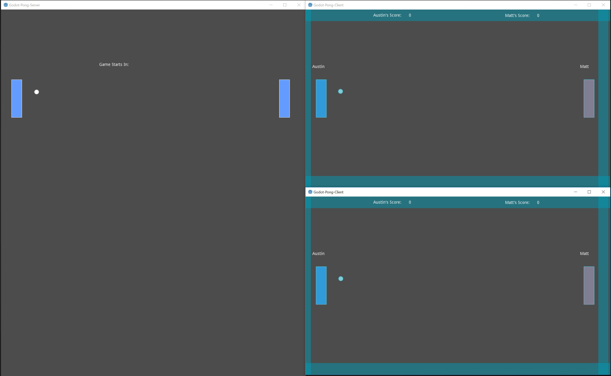
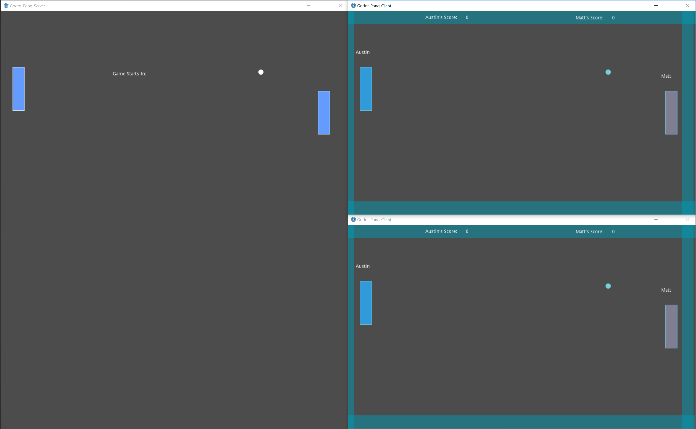
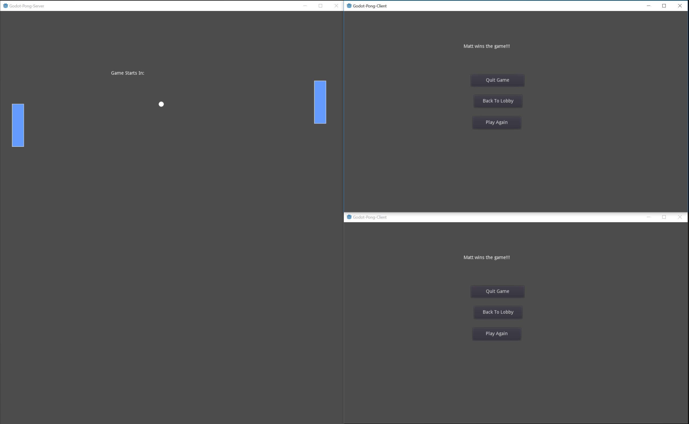

# Godot-Pong-Client
This is the player(client) for my version of the game Pong, which utilizes networked gameplay.  In the below pictures, the clients playing the game are on the right side and the left side is the server.  The server mirrors the gameplay of the clients.

The client was created completely using the Godot Engine, utilizing remote procedure calls to communicate with the dedicated server.

## Screenshots:

